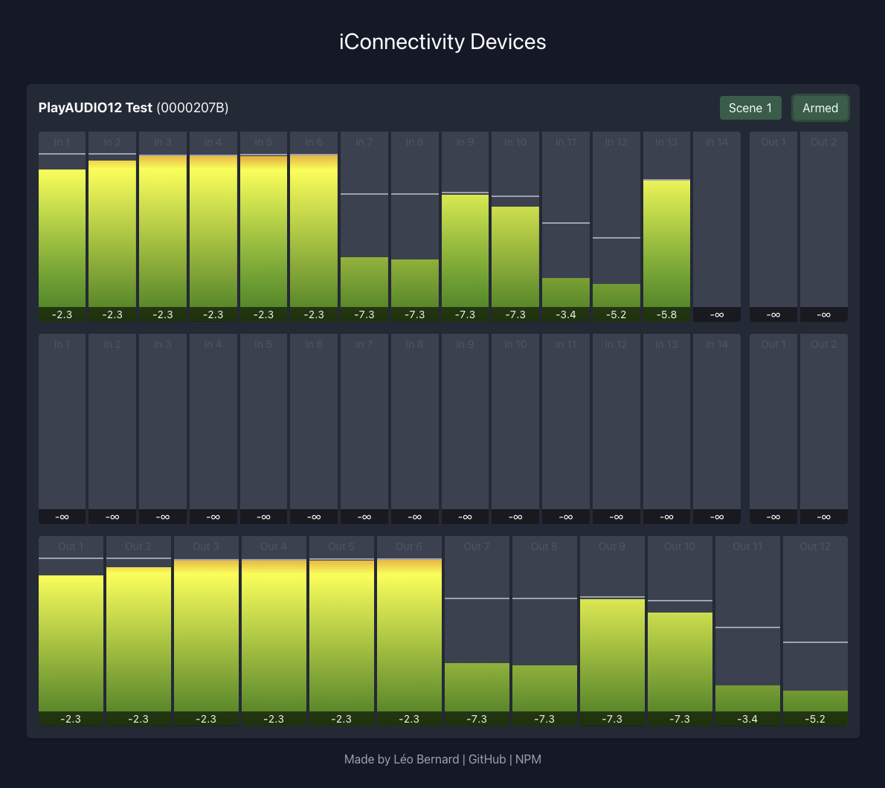

# iConnectivity JS Demo

This demo project makes use of iConnectivity JS to fetch and display data about
connected devices. It works best on Chrome, Edge, and Opera.

[View the Live Demo](https://icjs.leolabs.org)

